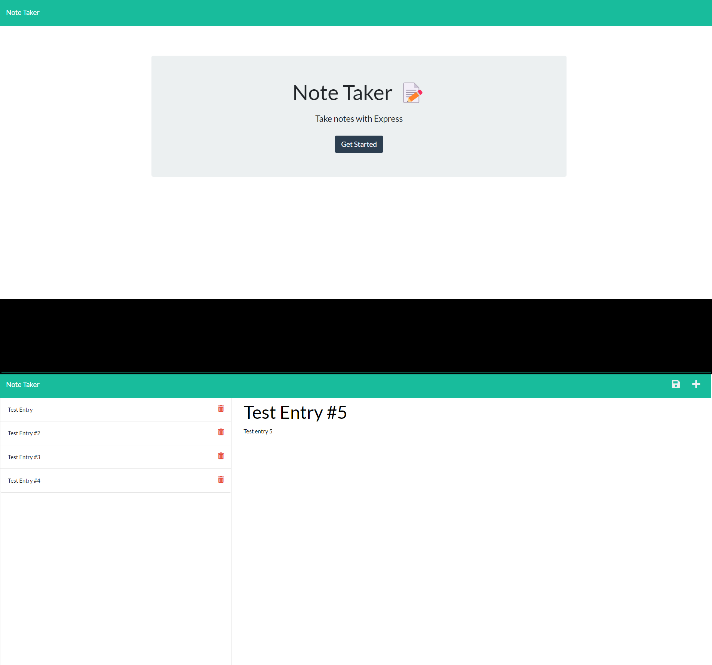

# 11-Express-Note-Taker


## Challenge User Story

```md
AS A small business owner
I WANT to be able to write and save notes
SO THAT I can organize my thoughts and keep track of tasks I need to complete
```


## Challenge Acceptance Criteria

```md
GIVEN a note-taking application
WHEN I open the Note Taker
THEN I am presented with a landing page with a link to a notes page
WHEN I click on the link to the notes page
THEN I am presented with a page with existing notes listed in the left-hand column, plus empty fields to enter a new note title and the note’s text in the right-hand column
WHEN I enter a new note title and the note’s text
THEN a Save icon appears in the navigation at the top of the page
WHEN I click on the Save icon
THEN the new note I have entered is saved and appears in the left-hand column with the other existing notes
WHEN I click on an existing note in the list in the left-hand column
THEN that note appears in the right-hand column
WHEN I click on the Write icon in the navigation at the top of the page
THEN I am presented with empty fields to enter a new note title and the note’s text in the right-hand column
```


## General info

This is an application that uses the express node module to implement a note-recording function that allows the end user to save and recall the notes that were input and saved. The information is retrieved from an associated JSON file in the backend. 

Link to the deployed application on Heroku:
* [Note Taker - Take Notes with Express](https://fast-lake-22331.herokuapp.com/)
* URL: https://fast-lake-22331.herokuapp.com/

## Applied Technologies

* [Node.js](https://nodejs.org/en/docs/) 
* [NPM](https://www.npmjs.com/) 
* [Express.js](https://expressjs.com/en/guide/routing.html)


## Application Functionality

The following image shows html output generated by the application:

